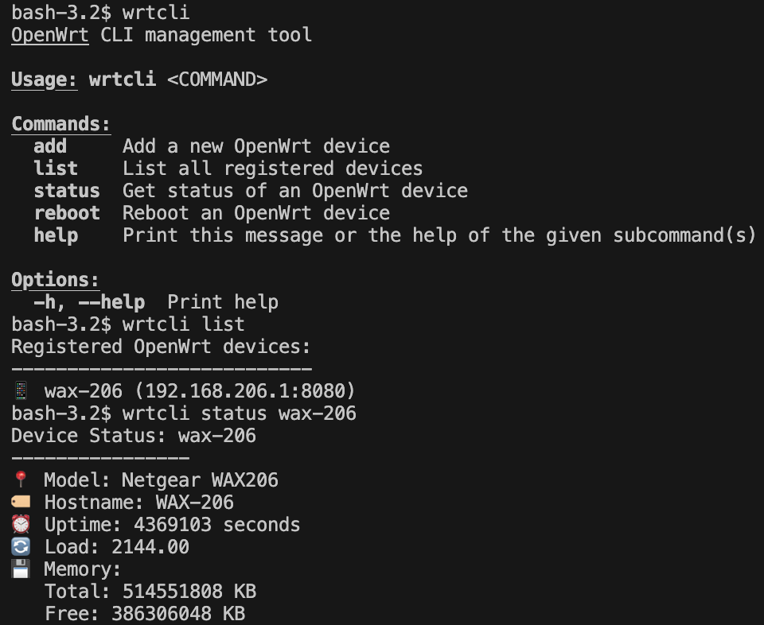

# wrtcli

用 Rust 開發的 OpenWrt CLI 管理工具。

## 功能特色

✅ 統一的 CLI 工具用於遠端管理 OpenWrt  
✅ 支援多台 OpenWrt 設備的批量操作  
✅ 透過 Ubus JSON-RPC API、LuCI REST API 或 SSH 存取  
✅ 輕量級設計，不需要在 OpenWrt 安裝額外套件  
✅ 具高度可擴展性，未來可支援更多 OpenWrt 服務

## 安裝方式

```bash
# 下載專案
git clone https://github.com/yihua1218/wrtcli.git
cd wrtcli

# 建置專案
cargo build --release

# 選擇性：安裝執行檔
cargo install --path .
```

## 執行畫面



上圖展示了：
- 清晰的命令列介面與說明資訊
- 已註冊設備的列表功能
- 詳細的狀態顯示，包含：
  - 設備型號與主機名稱
  - 系統運行時間與負載
  - 記憶體使用狀況，格式清楚易讀

## 使用方式

### 設備管理

```bash
# 新增 OpenWrt 設備
wrtcli add router1 --ip 192.168.1.1 --user root --password mypassword

# 顯示所有已註冊的設備
wrtcli list

# 取得設備狀態
wrtcli status router1

# 重新啟動設備
wrtcli reboot router1
```

### 設定檔

設定檔儲存於 `~/.wrtcli/config.toml`，用於安全地管理設備資訊。

## 系統需求

- Rust 1.70+
- OpenWrt 19.07+ (需支援 Ubus API)
- Linux / macOS / Windows

## 開發說明

### 專案結構

```
src/
├── main.rs        # 程式進入點與 CLI 結構
├── commands.rs    # 指令實作
├── config.rs      # 設定檔管理
└── models.rs      # 資料結構
```

### 從原始碼建置

```bash
# 偵錯版本建置
cargo build

# 正式版本建置
cargo build --release
```

## 參與貢獻

歡迎提出問題與貢獻程式碼！請隨時提交 issues 和 pull requests。

## 授權條款

本專案使用 MIT 授權 - 詳見 LICENSE 檔案。

## 開發規劃

- [x] 核心設備管理
- [x] 基本狀態監控
- [ ] Wi-Fi 管理
- [ ] DHCP 操作
- [ ] DNS 管理
- [ ] 防火牆設定
- [ ] 批次操作功能
